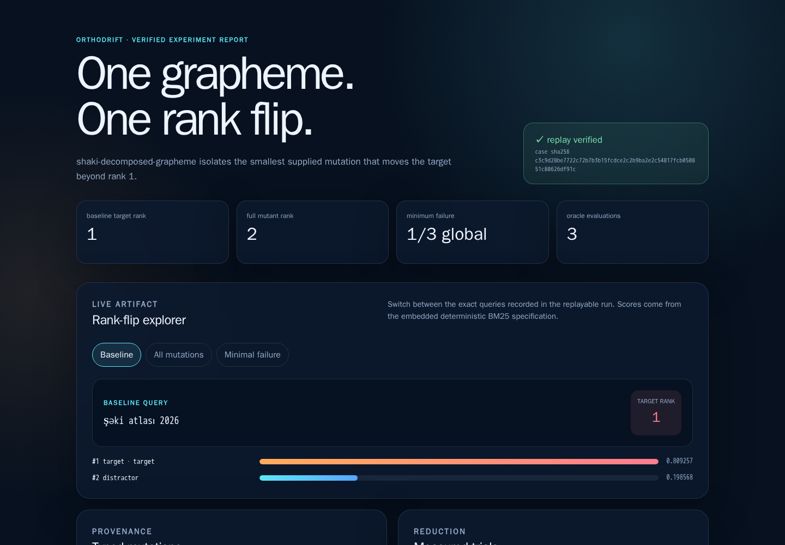
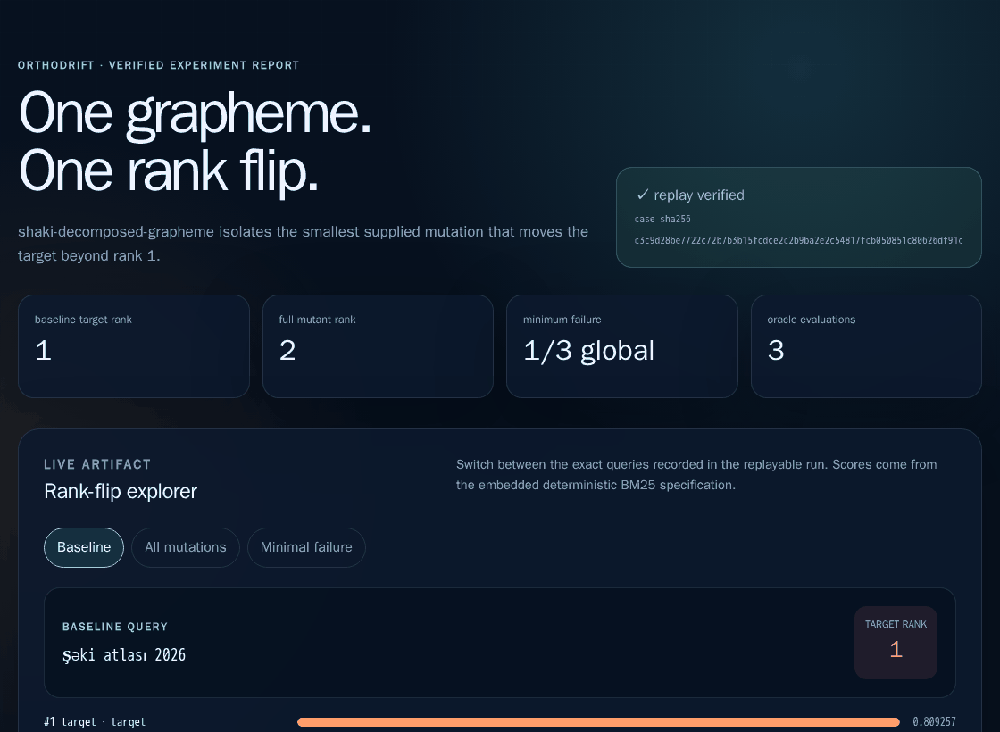
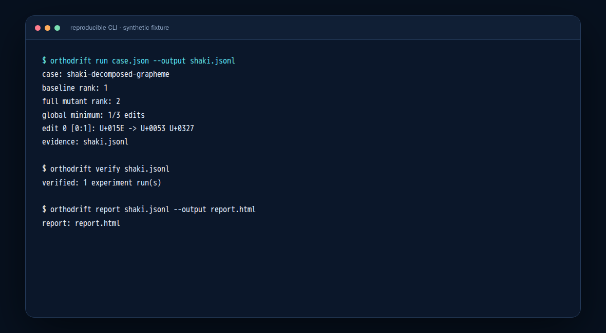
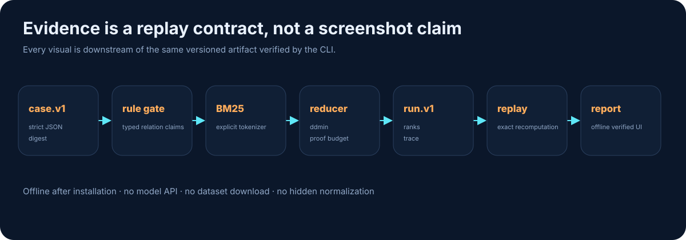
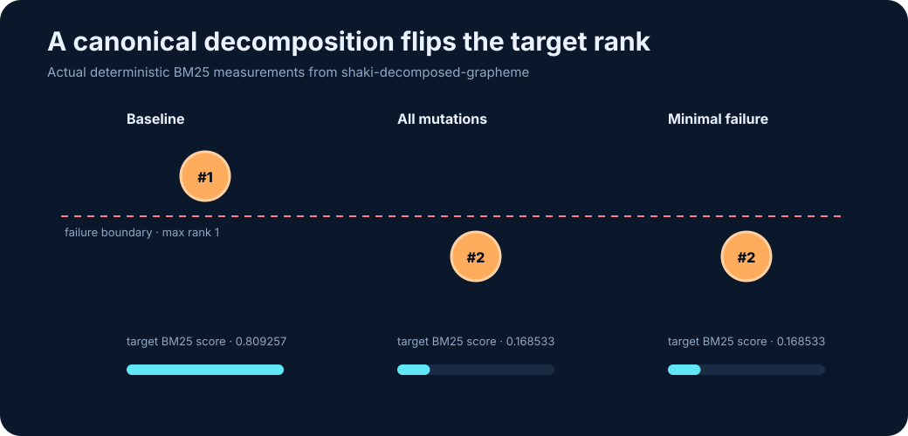
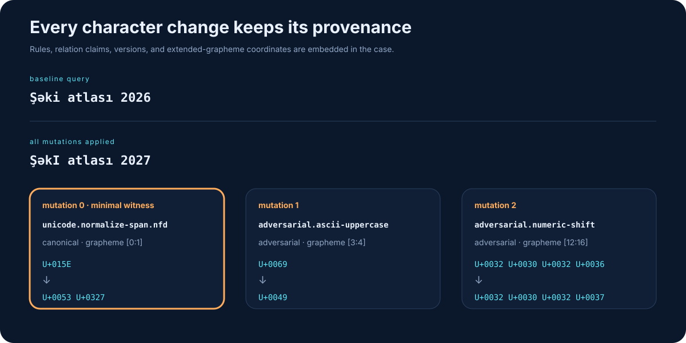
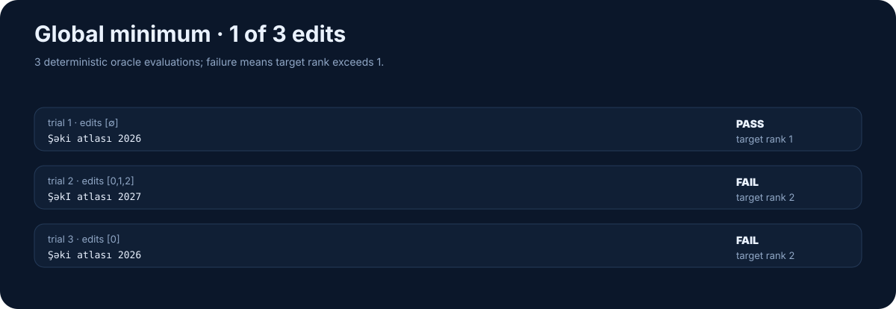
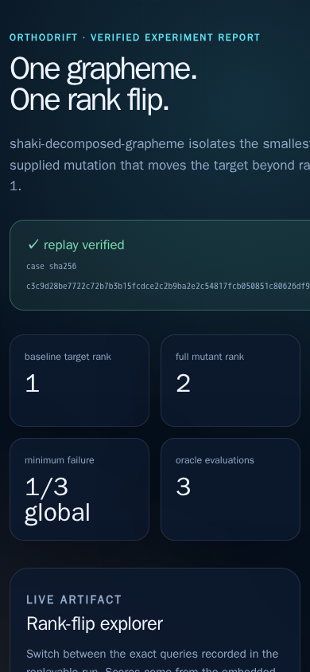

# OrthoDrift

<p align="center">
  <strong>Minimal counterexamples for orthographic failures in multilingual retrieval.</strong>
</p>

<p align="center">
  <a href="https://github.com/omar07ibrahim/orthodrift/actions/workflows/ci.yml"></a>
  <a href="https://github.com/omar07ibrahim/orthodrift/actions/workflows/evidence.yml"></a>
  
  
</p>



A reader sees `Şəki` and `Şəki` as the same word. A tokenizer does not have to.
OrthoDrift turns that gap into a versioned experiment: it applies typed
grapheme-level mutations, measures a deterministic retriever, reduces a failure
to the smallest supplied edit set, and writes an artifact that must replay
exactly before it is called verified.

The committed synthetic case has one deliberately narrow result:

| Measurement | Actual result |
| --- | ---: |
| Baseline target rank | **1** |
| All three mutations | **2** |
| Globally minimal failure | **1 / 3 edits** |
| Minimal mutation | `U+015E → U+0053 U+0327` |
| Reducer evaluations | **3** |

This demonstrates a canonical-decomposition rank flip in one lexical fixture.
It is not a broad multilingual benchmark, native-language review, dense
retrieval evaluation, or a claim that visual similarity implies equivalence.

## Watch the artifact, not a mockup



The animation above is captured from the HTML emitted by the released
`orthodrift report` command. Each state reads the same verified
`orthodrift.experiment-run.v1` artifact; there is no separate demo dataset or
hand-authored chart data.

## Run the complete workflow

OrthoDrift 0.1 supports CPython 3.11–3.14 and performs no network calls at
runtime.

```bash
git clone https://github.com/omar07ibrahim/orthodrift.git
cd orthodrift
python3 -m venv .venv
. .venv/bin/activate
python -m pip install .
```

Generate, replay, and render the committed case:

```bash
orthodrift run examples/shaki-rank-flip.json --output shaki.jsonl
orthodrift verify shaki.jsonl
orthodrift report shaki.jsonl --output report.html
```

Existing artifacts and reports are no-clobber by default. Use `--force` only
when replacement is intentional.



The machine-readable [run artifact](docs/evidence/shaki-run.jsonl), exact
[terminal transcript](docs/evidence/shaki-cli.txt), and self-contained
[offline report](docs/evidence/shaki-report.html) are committed beside the
screenshots.

## How a rank flip becomes evidence



1. A strict `orthodrift.case.v1` file declares documents, query, target, rank
   threshold, mutations, rule packs, Unicode versions, and proof budget.
2. Registered rules regenerate their claimed mutation. “Canonical,”
   “orthographic,” “confusable,” and “adversarial” are typed relations, not
   labels inferred from a rule name.
3. The explicit Unicode-word tokenizer and deterministic BM25 implementation
   measure the baseline, full mutation, and every reducer trial.
4. Delta debugging finds a one-minimal failure; bounded exhaustive search
   upgrades it to a global minimum when the proof completes.
5. `orthodrift.experiment-run.v1` binds the case digest, retriever specification,
   all ranks, full reduction trace, package/runtime fingerprint, and engine
   digest.
6. Verification requires the recorded environment and recomputes the complete
   run. The report is rendered only after that replay succeeds.

The deeper component and trust-boundary explanation is in
[docs/architecture.md](docs/architecture.md).

## The measured failure



The baseline target score is higher than the distractor and the target ranks
first. Decomposing `Ş` into `S + COMBINING CEDILLA` changes token identity
without changing canonical meaning. The target then ranks second, beyond the
case's `max_rank = 1` threshold.

### Typed grapheme provenance



Edits use extended grapheme-cluster coordinates, so a base character plus
combining mark remains one unit. Every mutation retains its rule ID, parameters,
relation claim, rule-pack version, Unicode version, and optional seed. Built-in
rules reject provenance that they cannot reproduce.

### Reduction trace



The reducer caches oracle calls, validates that the baseline passes and the full
mutation fails, then preserves every evaluated query and result. “Global”
means the returned subset has the fewest supplied mutation units—not the fewest
Unicode code points in every possible string transformation.

## Offline report

The report is a single HTML file with no external scripts, fonts, images,
analytics, APIs, or personal data. It includes keyboard-accessible state buttons,
responsive ranking bars, mutation provenance, measured trials, the runtime
fingerprint, and an explicit claim boundary.

<p align="center">
  
</p>

A [full-page 1440px capture](docs/evidence/shaki-report-full.png) is also
committed. The narrow viewport is regression-checked so long digests cannot
stretch or crop the layout.

## Reproducibility and evidence drift

Application, quality, and browser dependencies are pinned separately:

- `requirements/runtime.txt` locks the `regex` runtime with hashes.
- `requirements/quality.txt` locks the exact Python 3.14.6 test/build toolchain.
- `requirements/evidence-browser.txt` locks Playwright/Pillow wheels with hashes.
- `requirements/evidence-browser-image.lock.json` pins the linux/amd64
  Playwright image by platform-manifest digest.

The permanent evidence workflow is read-only. It rebuilds the real CLI artifact
and report on Python 3.14.6, captures them in Chromium 151 with networking
disabled, replays both generated and committed artifacts, validates SVG/raster
contracts, and compares all 13 committed evidence files byte for byte.

The [evidence manifest](docs/evidence/orthodrift-evidence.json) records every
file hash, source hash, Git revision/tree, viewport, browser, Python, Unicode,
`regex`, Playwright, Pillow, and container image. See
[docs/evidence-method.md](docs/evidence-method.md) for the update protocol.

Run the non-browser quality contract locally:

```bash
python -m pip install --no-deps --require-hashes -r requirements/quality.txt
python -m pip install --no-build-isolation --no-deps .
python -m ruff check .
python -m ruff format --check .
python -m mypy
python -m pytest -q
```

## Security and research boundary

The CLI rejects duplicate JSON keys, non-finite values, invalid Unicode,
excessive nesting, case files over 1 MiB, artifacts over 16 MiB or 1,000
records, cases above 4,096 documents or 64 mutations, and proof budgets above
100,000. Output publication is atomic. Verification detects altered case
digests, ranks, reduction traces, runtime fingerprints, and engine code.

Read [SECURITY.md](SECURITY.md) before processing untrusted bulk inputs. The
accepted experimental contract, non-goals, and false-merge requirements are in
[RFC 0001](docs/rfcs/0001-project-scope.md).

## Repository map

```text
src/orthodrift/       typed engine, retrieval, reducer, artifacts, report
examples/             synthetic, reviewable case input
tests/                schema, Unicode, retrieval, replay, CLI, report contracts
docs/evidence/        generated outputs, diagrams, screenshots, GIF, manifest
requirements/         hash-locked runtime, quality, and capture environments
tools/                 evidence generator and independent bundle checks
```

## Release history and license

Version 0.1.0 is the first complete deterministic vertical slice; see
[CHANGELOG.md](CHANGELOG.md). Contributions must preserve claim provenance and
reproducibility—start with [CONTRIBUTING.md](CONTRIBUTING.md).

Apache License 2.0. See [LICENSE](LICENSE).
